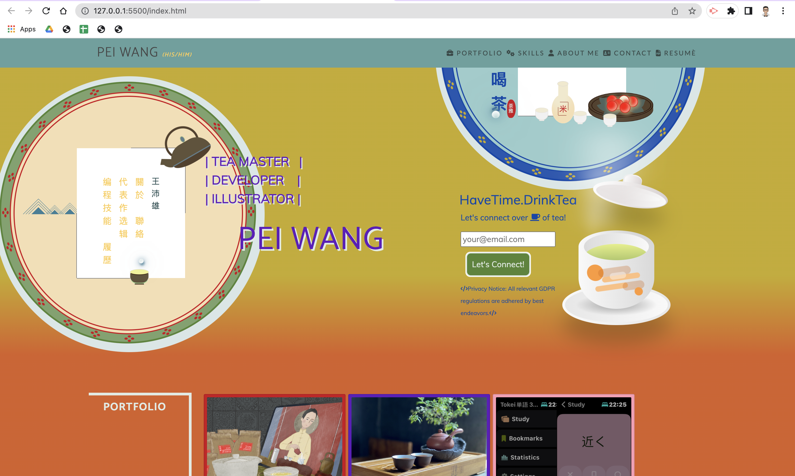
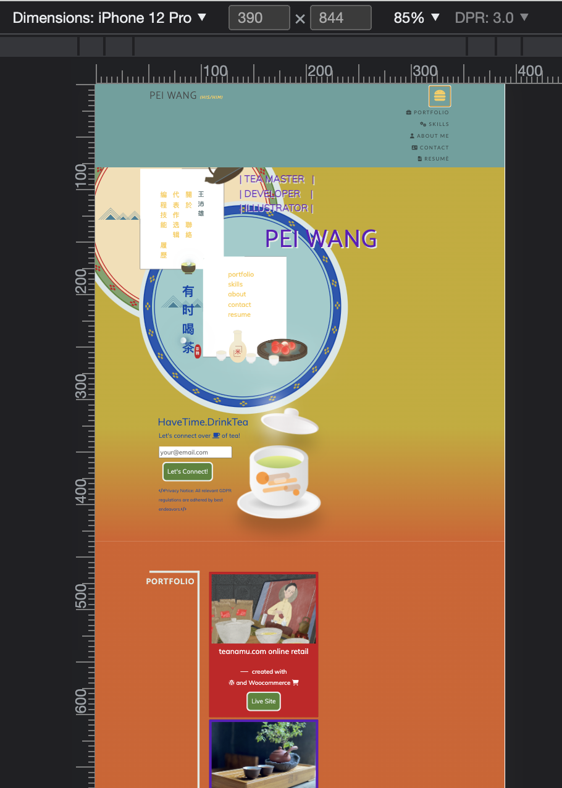

# w03_portfolio_with_bootstrap

## Description

This project is part of the Frontend Dev Bootcamp course challenge for week 3 "UX and Advance CSS Bootstrap Portfolio". It requires us to (re)create (from our week 2 challenge) a portfolio web page using Bootstrap css. Bootstrap version 4.6 is used in this project.

This week, we learnt about the wonders of Bootstrap. Through this project, I have an opportunity to demonstrate my ability to recreate a webpage using Bootstrap. I have also anchored my understanding of HTML/CSS, the git workflow, github, terminal commands, VSCode, editing a markdown document and debuging using browser developer mode. I have also had a lot of fun researching and creating artwork using CSS and CSS animation functionalities. 

As with the last project, this project takes the "mobile last" approach as it is anticipated that recruiting agents are more likely to be using a laptop/desktop or a larger tablet than a mobile. Bootstrap makes it so much easier to make the webpage responsive.

Other than the first project listed in the portfolio section of my webpage, the rest of the projects are all fictitious or website / apps that I would love to have made. 

### Wireframe of this Portfolio Showcase Webpage

[Refer to previous week's project](https://github.com/HaveTimeDrinkTea/w02_challenge_portfolio_showcase)

### Methodology

* Redesign the Jumbotron / Hero area.
* Create the main HTML structure using a bootstrap starting template.
* Create all the necessary css (in various .css files if necessary)
* Make the changes and follow a git workflow.
* Provide content for copy writings and images for the projects.

### Further Issues Requiring Attention

* Update all the links with real links.
* Implement cookie consent and check compliance with GDPR.
* Create the script(s) need to collect email leads from the contact me section.

## User Story

AS A new frontend developer
I WANT an online portfolio that utlizes Bootstrap CSS and follows accessibility standards, responsive to various screens and SEO
SO THAT potential hiring agents can look at previous work and be impressed enough to contact me.

[Deployment link](https://havetimedrinktea.github.io/w03_portfolio_with_bootstrap/)

## Acceptance Criteria

The webpage must meet the following acceptance criteria:

* Proper folder structure for the webpage.
* Using Bootstrap to re-create a portfolio webpage with the following components:
  ** a navigation bar
  ** a navigation menu at the top with links that are applicable with the portfolio and naviate to the relevant sections.
  ** a hero section
  ** a portfolio section using bootstrap cards and link to current/future applications.
  ** a skills section listing my skills
  ** an about/contact section
  ** a footer section
  ** all hyperlinks that have hover effect 
  ** all buttons with box shadow on hover
* The webpage using Bootstrap should minimise use of media queries
* The bootstrap-powered portfolio page to be deployed to GitHub pages.

## Table of Contents (Optional)

* [Installation](#installation)
* [Usage](#usage)
* [Credits](#credits)
* [License](#license)
* [Features](#features)
* [Testing](#testing)

## Installation

N.A.

## Usage 

Screen shots of the submitted webpage on different screen sizes:

### Big Screen

### Mobile / Smaler Tablet Screen

## Credits

* All images used on this web page are owned by me.
* Used Bootstrap V.4.6.
* Used Font Awesome v4.7. [Link to Font Awesome](https://fontawesome.com).
* Webpage colour scheme RGB take from [Link to site](http://khroma.co/generator/).
* Modified the code of the Chinese Circular Frames CSS design by Ye Yiyi (叶一一) and used the modified animation on this web page. [CSS Only Morphing Blob Demo](https://juejin.cn/post/7143499534025359374)

## License

MIT License

## Features

* Web page to showcase 
  ** my design aesthetic and knowledge of HTML/CSS using Bootstrap
  ** my (future) project porfolio 
* As the header section includes some css animation, I've added @media (prefers-reduced-motion: reduce) to honour devices with reduced motion settings.

	
	
## Testing

The new webpage will be assessed against download speed and accessibility at a later date. 

